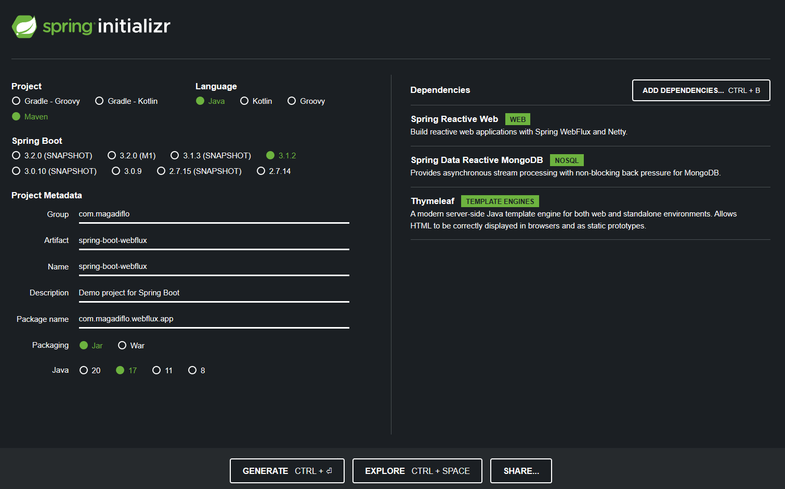
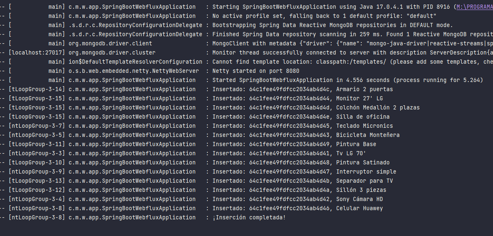
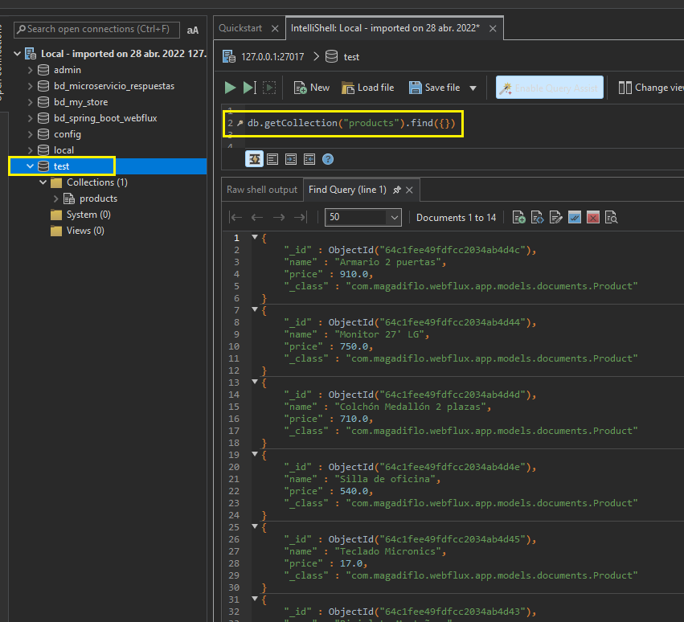
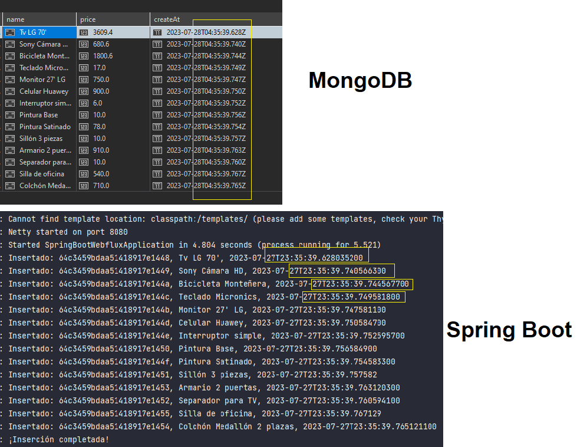
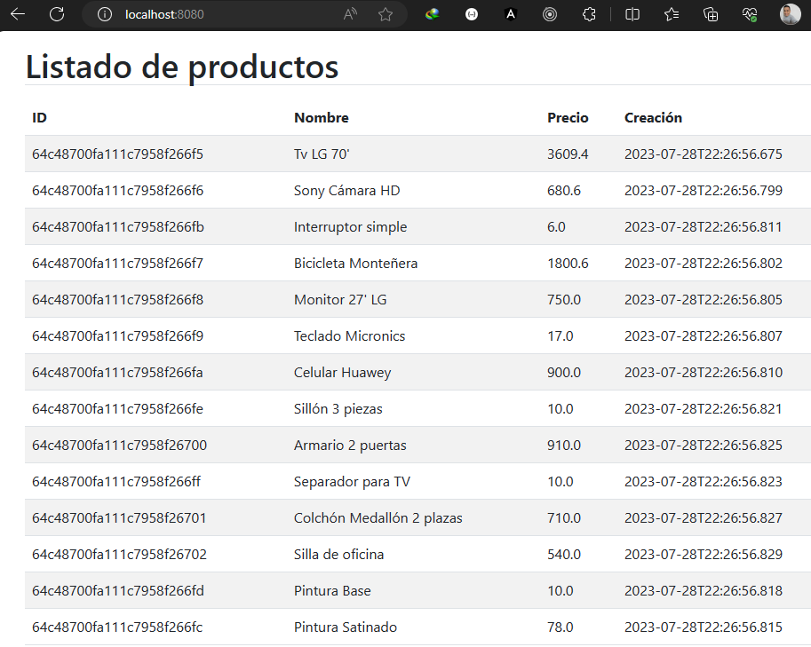
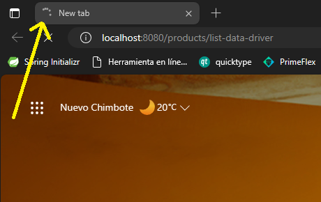
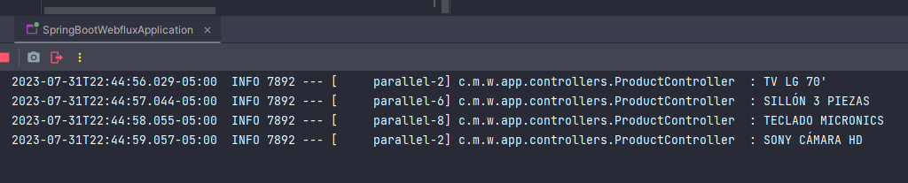
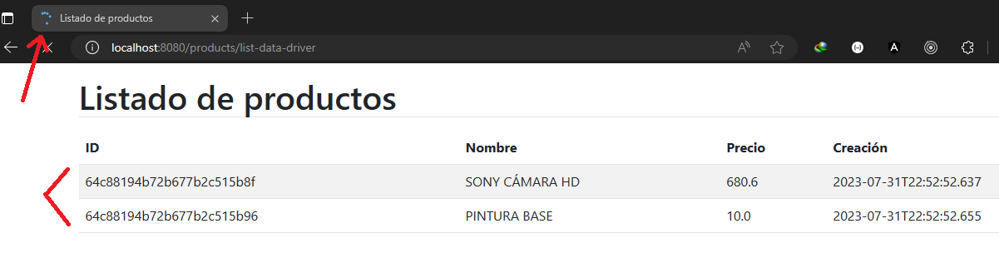

# Sección 3: Introducción programación reactiva con Spring WebFlux

Creación del proyecto



## Programación Reactiva

La programación reactiva es un paradigma de programación orientado al flujo de datos (streams) y la propagación del
cambio, todo de forma asíncrona.

Esto quiere decir que la programación reactiva se sustenta en el patrón de diseño Observer, donde se tiene un Publisher
y uno o más Suscribers que reciben notificaciones cuando el Publisher emite nuevos datos.

En la programación reactiva, **el Publisher es el que se encarga de emitir el flujo de datos** y **propaga el cambio
(notifica) a los Suscribers.**

Por lo tanto, podemos decir que la programación reactiva se basa en 3 conceptos clave:

- **Publisher:** También llamados **Observables.** Estos objetos son los que emiten el flujo de datos.
- **Suscriber:** También llamados **Observers.** Estos objetos son a los que se les notifican los cambios en el flujo de
  datos que emite el Publisher
- **Schedulers:** Es el componente que administra la concurrencia. Se encarga de indicarle a los Publishers y Suscribers
  en que thread deben ejecutarse.

## Agregando clases del modelo document y repository

Cuando trabajamos con SQL creábamos entities mapeados a tablas de una base de datos relacional. Ahora, como estamos
trabajando con MongoDB, que **es una base de datos NoSQL**, trabajaremos con **colecciones y no con tablas.**

Como primer paso, crearemos la colección a productos y su interface de repositorio:

````java

@Document(collection = "products")
public class Product {
    @Id
    private String id;
    private String name;
    private Double price;
    private LocalDateTime createAt;

    public Product() {
    }

    public Product(String name, Double price) {
        this.name = name;
        this.price = price;
    }

    /* getters and setters */
}
````

````java
public interface IProductRepository extends ReactiveMongoRepository<Product, String> {
}
````

## Importando datos de ejemplo y el operador flatMap

Si recordamos, cuando creábamos nuestra aplicación normal, basada en servlets, podíamos crear un archivo **import.sql**
para poder insertar en automático nuestros datos, pero como ahora estamos trabajando con una base de datos **NoSQL**,
debemos buscar otra manera de poder insertar datos de prueba. Una forma de hacerlo es de manera programática, veamos
cómo:

````java

@SpringBootApplication
public class SpringBootWebfluxApplication {

    private final static Logger LOG = LoggerFactory.getLogger(SpringBootWebfluxApplication.class);
    private final IProductRepository productRepository;

    public SpringBootWebfluxApplication(IProductRepository productRepository) {
        this.productRepository = productRepository;
    }

    /* main method omitted */

    @Bean
    public CommandLineRunner run() {
        return args -> {
            Flux.just(
                            new Product("Tv LG 70'", 3609.40),
                            new Product("Sony Cámara HD", 680.60),
                            new Product("Bicicleta Monteñera", 1800.60),
                            new Product("Monitor 27' LG", 750.00),
                            new Product("Teclado Micronics", 17.00),
                            new Product("Celular Huawey", 900.00),
                            new Product("Interruptor simple", 6.00),
                            new Product("Pintura Satinado", 78.00),
                            new Product("Pintura Base", 10.00),
                            new Product("Sillón 3 piezas", 10.00),
                            new Product("Separador para TV", 10.00),
                            new Product("Armario 2 puertas", 910.00),
                            new Product("Colchón Medallón 2 plazas", 710.00),
                            new Product("Silla de oficina", 540.00)
                    )
                    .flatMap(this.productRepository::save)
                    .subscribe(
                            product -> LOG.info("Insertado: {}, {}", product.getId(), product.getName()),
                            error -> LOG.error("Error al insertar: {}", error.getMessage()),
                            () -> LOG.info("¡Inserción completada!")
                    );

        };
    }
}
````

En el código anterior usamos la interfaz funcional **CommandLineRunner** anotándolo con **@Bean**. De esta manera
nuestra aplicación se ejecutará una vez arranque el mismo.

### flatMap

Estamos usando el flatMap, ya que dentro de él usamos el ``this.productRepository.save(product)`` para mandar a guardar
el **Product** emitido. Este **save()** nos retorna un ``Mono<Product>``. Finalmente, cuando hacemos el **subscribe()**
lo que recibimos es el model **product** guardado.

Ahora, corremos la aplicación y este será el resultado obtenido en consola:



Si revisamos la base de datos de MongoDB veremos que **por defecto se insertaron los productos en la base de datos
Test**, es decir, hasta este punto no hemos configurado ninguna base de datos, pero por defecto al ejecutar la
aplicación utilizó la base de datos **test** para insertar nuestros datos:



## Eliminando colección de productos (drop collection)

En la sección anterior implementamos el método **run()** de la interfaz funcional **CommandLineRunner** para poder
poblar la base de datos de MongoDB con valores iniciales. Ahora, el problema es que cada vez que levantamos la
aplicación los datos se van registrando, es decir se van duplicando los datos. Entonces para evitar eso,
lo que haremos será que antes de poblar la base de datos con registros, primero eliminaremos todo lo que haya en la
colección, de esa manera tendremos siempre el mismo conjunto de datos.

````java

@SpringBootApplication
public class SpringBootWebfluxApplication {

    /* Other code */
    private final ReactiveMongoTemplate reactiveMongoTemplate; // (1)

    public SpringBootWebfluxApplication(IProductRepository productRepository, ReactiveMongoTemplate reactiveMongoTemplate) {
        this.productRepository = productRepository;
        this.reactiveMongoTemplate = reactiveMongoTemplate;
    }

    @Bean
    public CommandLineRunner run() {
        return args -> {
            this.reactiveMongoTemplate.dropCollection("products").subscribe(); // (2)

            /* Código que puebla la colección de products */
        };
    }
}
````

**DONDE**

- **(1)** aplicamos inyección de dependencia vía constructor para el **ReactiveMongoTemplate**. Con esta clase podemos
  eliminar directamente la colección **products**.
- **(2)** usando el **ReactiveMongoTemplate** llamamos al método **dropCollection()** para eliminar la colección
  **products**.

### ReactiveMongoTemplate

ReactiveMongoTemplate es una clase auxiliar que nos ayuda a incrementar nuestras consultas a la BD mediante las
MongoOperations de manera reactiva.

Implementación principal de ReactiveMongoOperations. Simplifica el uso de Reactive MongoDB y ayuda a evitar errores
comunes. Ejecuta el flujo de trabajo central de MongoDB, dejando el código de la aplicación para proporcionar documentos
y extraer resultados. Esta clase ejecuta consultas o actualizaciones de BSON, iniciando la iteración sobre FindPublisher
y capturando las excepciones de MongoDB y traduciéndolas a la jerarquía de excepción genérica y más informativa definida
en el paquete org.springframework.dao.

## Cambiando el nombre de la base de datos y agregando la fecha createAt

Por defecto, cuando arrancamos la aplicación, los datos se van a poblar en la base de datos **test de mongoDB**, pero
ahora nosotros crearemos nuestra propia base de datos llamada **db_spring_boot_webflux**.

En el **application.properties** creamos la cadena de conexión a la base de datos de MongoDB agregándole el nombre que
le daremos a nuestra base de datos.
****

````properties
spring.data.mongodb.uri=mongodb://localhost:27017/db_spring_boot_webflux
````

Como nota final, si la base de datos **db_spring_boot_webflux** no está creada, al arrancar la aplicación, mongoDB
la va a crear por nosotros.

Ahora, con respecto a agregar fecha a nuestros registros, podemos usar el operador **flatMap()** para que en su interior
poblemos con la fecha actual a cada producto que va pasando:

````java

@SpringBootApplication
public class SpringBootWebfluxApplication {
    @Bean
    public CommandLineRunner run() {
        return args -> {
            this.reactiveMongoTemplate.dropCollection("products").subscribe();
            Flux.just(/* data */)
                    .flatMap(product -> {
                        product.setCreateAt(LocalDateTime.now()); //<-- asignando fecha actual a cada producto
                        return this.productRepository.save(product);
                    });
            /* other code */
        };
    }
}
````

**IMPORTANTE**

> **MongoDB almacena las horas en UTC de forma predeterminada y convierte cualquier representación de la hora local a
> este formato.** Las aplicaciones que deben operar o informar sobre algún valor de hora local sin modificar pueden
> almacenar la zona horaria junto con la marca de tiempo UTC y calcular la hora local original en su lógica de
> aplicación.
>
> [FUENTE: MongoDB](https://www.mongodb.com/docs/manual/tutorial/model-iot-data/)

Ahora, en nuestra aplicación de **Spring Boot**, nuestra base de datos **MongoDB** también está almacenando nuestra zona
de horario local en **UTC**, pero cuando lo recuperamos con las consultas de un **MongoRepository**, realiza la
conversión automáticamente y recupera nuestra fecha y hora correcta.



## Creando controlador y vista reactivos

Crearemos un controlador del tipo **@Controller**, ya que nuestras vistas serán renderizadas en plantillas html usando
**thymeleaf**.

````java

@Controller
@RequestMapping(path = {"/", "/products"})
public class ProductController {
    private final IProductRepository productRepository;

    public ProductController(IProductRepository productRepository) {
        this.productRepository = productRepository;
    }

    @GetMapping(path = {"/", "/list"})
    public String list(Model model) {
        Flux<Product> productFlux = this.productRepository.findAll();
        model.addAttribute("products", productFlux);
        model.addAttribute("title", "Listado de productos");
        return "list";
    }
}
````

Como observamos en el código anterior, **en ningún momento estamos haciendo el subscribe() del flux de productos para
empezar a recibir los datos.** Nosotros no debemos preocuparnos por eso, **quien se subscribirá al flux será la vista de
Thymeleaf**, él lo hará por nosotros.

El html usando Thymeleaf sería el siguiente (qu)

````html
<!DOCTYPE html>
<html lang="en" xmlns:th="http://www.thymeleaf.org">
<head>
    <meta charset="UTF-8">
    <title th:text="${title}"></title>
    <!-- link to bootstrap -->
</head>
<body>
<main class="container">
    <h1 th:text="${title}" class="my-3 border-bottom"></h1>
    <table class="table table-striped table-hover">
        <thead>
        <tr>
            <th>ID</th>
            <th>Nombre</th>
            <th>Precio</th>
            <th>Creación</th>
        </tr>
        </thead>
        <tbody>
        <tr th:each="product: ${products}">
            <td th:text="${product.id}"></td>
            <td th:text="${product.name}"></td>
            <td th:text="${product.price}"></td>
            <td th:text="${product.createAt}"></td>
        </tr>
        </tbody>
    </table>
</main>
</body>
</html>
````

Finalmente, al ejecutar la aplicación veremos el siguiente resultado:



## Subscribiendo otro Observador y modificando el Stream Reactivo

**(1)** Crearemos un nuevo **observer (suscriber)** que se subscribirá al **observable (publisher)** definido en la
variable **productFlux** para mostrar los datos en consola, este sería nuestro segundo subscriptor, el primero es
nuestra vista de Thymeleaf que también se encuentra subscrito por defecto a dicho observable.

Además, utilizamos el operador **map()** solo para hacer una modificación a cada elemento del flujo:

````java

@Controller
@RequestMapping(path = {"/", "/products"})
public class ProductController {
    private final static Logger LOG = LoggerFactory.getLogger(ProductController.class);
    /* omitted code */

    @GetMapping(path = {"/", "/list"})
    public String list(Model model) {
        Flux<Product> productFlux = this.productRepository.findAll()
                .map(product -> {
                    product.setName(product.getName().toUpperCase());
                    return product;
                });

        productFlux.subscribe(product -> LOG.info(product.getName())); // (1)

        model.addAttribute("products", productFlux);
        model.addAttribute("title", "Listado de productos");
        return "list";
    }
}
````

## Modo Reactive Data Driver para manejar la contrapresión

**Comportamiento por defecto:** Supongamos que tenemos muchos registros que serán mostrados en pantalla y experimentamos
un retraso de un segundo. Para configurar dicho retraso utilizaremos el operador **delayElements()** de flux para
decirle que se demorará en emitir cada elemento 1 segundo:

````java

@Controller
@RequestMapping(path = {"/", "/products"})
public class ProductController {

    @GetMapping(path = "/list-data-driver")
    public String listDataDriver(Model model) {
        Flux<Product> productFlux = this.productRepository.findAll()
                .map(product -> {
                    product.setName(product.getName().toUpperCase());
                    return product;
                })
                .delayElements(Duration.ofSeconds(1)); // <-- Configurando retraso de 1 segundo

        productFlux.subscribe(product -> LOG.info(product.getName()));

        model.addAttribute("products", productFlux);
        model.addAttribute("title", "Listado de productos");
        return "list";
    }
}
````

Ejecutamos la aplicación y observamos el comportamiento de este nuevo endpoint:



La imagen anterior nos muestra que se está cargando la página correspondiente al endpoint. **El tiempo que se demora
realizando esa carga es igual al número de elementos que el flux emite**, en nuestro caso tenemos 14 elementos y
cada elemento le toma 1 segundo en cargar (por el delay que pusimos), por lo tanto, **el tiempo que le toma en cargar
a nuestra página es de 14 segundos.**

El mismo comportamiento lo podemos observar en el log, donde los elementos se van cargando cada 1 segundo, en la
imagen solo se han cargado 4 elementos (4 segundos). Una vez que finaliza la emisión tendremos pintada todos los
elementos en la web:



Pero, qué pasa si tenemos 1000 elementos, **¿tendremos que esperar 1000 segundos?**. Si lo dejamos tal cual está en el
ejemplo anterior sí se demoraría los 1000 segundos, pero podemos evitar ese comportamiento **configurando el tamaño del
buffer que se irán emitiendo, esto gracias al Reactive Data Driver que es una variable de contexto de la lista,**
es un controlador que maneja internamente eventos con los datos del stream.

````java

@Controller
@RequestMapping(path = {"/", "/products"})
public class ProductController {

    @GetMapping(path = "/list-data-driver")
    public String listDataDriver(Model model) {
        Flux<Product> productFlux = this.productRepository.findAll()
                .map(product -> {
                    product.setName(product.getName().toUpperCase());
                    return product;
                })
                .delayElements(Duration.ofSeconds(1));

        productFlux.subscribe(product -> LOG.info(product.getName()));

        model.addAttribute("products", new ReactiveDataDriverContextVariable(productFlux, 2)); //<-- (1) Configuración del buffer
        model.addAttribute("title", "Listado de productos");
        return "list";
    }
}
````

Tan solo agregando esta clase **(1)** le podemos configurar **cada cuántos elementos se tienen que enviar a la web para
que se muestren** y no esperar a que se hayan emitido todos para recién mostrarlos en la web. En pocas palabras con esa
configuración iremos mostrando cada 2 elementos en la web.



La imagen anterior nos muestra que **la web se está cargando**, pero que mientras lo hace, va pintando cada 2 elementos
según se van emitiendo los elementos del flux.

## Modo Chunked para manejar la contrapresión

Con el modo chunked establecemos un límite, **un tamaño máximo para el chunked, es decir para el buffer, pero en bytes**
ya no con un número de elementos como lo hicimos en la sección anterior, donde le definimos al buffer 2 elementos.

Para usar el chunked, agregamos la siguiente configuración en el application.properties, donde se emitirán los elementos
de 1024 bytes en 1024 bytes. Ahora, si solo dejamos esta configuración, el **chunk** se aplicarán a todas las vistas,
a todos los templates de nuestro proyecto:

````properties
spring.thymeleaf.reactive.max-chunk-size=1024
````

El endpoint que ejecutaremos será al endpoint del list:

````java

@Controller
@RequestMapping(path = {"/", "/products"})
public class ProductController {

    @GetMapping(path = "/list-full")
    public String listFull(Model model) {
        ThymeleafReactiveViewResolver viewResolver = new ThymeleafReactiveViewResolver();
        viewResolver.setResponseMaxChunkSizeBytes(1024);


        Flux<Product> productFlux = this.productRepository.findAll()
                .map(product -> {
                    product.setName(product.getName().toUpperCase());
                    return product;
                })
                .repeat(5000); //<-- Repetimos 5000 veces el flujo actual

        model.addAttribute("products", productFlux);
        model.addAttribute("title", "Listado de productos");
        return "list";
    }
}
````

Listo, con esto lo que deberíamos observar sería que **cuando se intente ingresar por el navegador a la url**
``http://localhost:8080/products/list-full`` debería ir imprimiendo la lista de productos de manera fragmentada, es
decir, de 1024bytes en 1024bytes.

**NOTA**
> En mi caso, como estoy trabajando con Spring Boot 3 y Spring Framework 6, no estoy evidenciando el
> comportamiento que muestra Andrés Guzmán, no he investigado el porqué sucede esto, pero lo dejaré anotado, ya que
> mi intención es trabajar con Api Rest Reactivos, y este tema de Thymeleaf solo es para tener conocimiento de su
> funcionamiento

## Modo Chunked view names

Si queremos que la **contrapresión solo se aplique a determinadas vistas**, podemos utilizar una configuración adicional
en nuestro **application.properties**:

````properties
## other properties
spring.thymeleaf.reactive.chunked-mode-view-names=list-chunked
````

Donde el **list-chunked corresponde a la vista template que se va a renderizar**. Por lo tanto, crearemos un nuevo
controlador que nos renderizará la plantilla de thymeleaf **list-chunked**:

````java

@Controller
@RequestMapping(path = {"/", "/products"})
public class ProductController {
    /* other code */

    @GetMapping(path = "/list-chunked")
    public String listChunked(Model model) {
        Flux<Product> productFlux = this.productRepository.findAll()
                .map(product -> {
                    product.setName(product.getName().toUpperCase());
                    return product;
                })
                .repeat(5000);

        model.addAttribute("products", productFlux);
        model.addAttribute("title", "Listado de productos");
        return "list-chunked"; //<-- Plantilla thymeleaf que aplicará la contrapresión. Mismo nombre que está en el archivo de configuración
    }
}
````

Luego, en el directorio **/resources/templates/** crearemos una nueva plantilla html de thymeleaf, quien aplicará la
contrapresión. La plantilla será el mismo que hemos venido usando hasta ahora:

````html
<!-- more tags -->
<main class="container">
    <h1 th:text="${title}" class="my-3 border-bottom"></h1>
    <table class="table table-striped table-hover">
        <thead>
        <tr>
            <th>ID</th>
            <th>Nombre</th>
            <th>Precio</th>
            <th>Creación</th>
        </tr>
        </thead>
        <tbody>
        <tr th:each="product: ${products}">
            <td th:text="${product.id}"></td>
            <td th:text="${product.name}"></td>
            <td th:text="${product.price}"></td>
            <td th:text="${product.createAt}"></td>
        </tr>
        </tbody>
    </table>
</main>
<!-- more tags -->
````

## API REST en WebFlux

Crearemos un api rest utilizando programación reactiva.

````java

@RestController
@RequestMapping(path = "/api/v1/products")
public class ProductRestController {
    private final static Logger LOG = LoggerFactory.getLogger(ProductRestController.class);
    private final IProductRepository productRepository;

    public ProductRestController(IProductRepository productRepository) {
        this.productRepository = productRepository;
    }

    @GetMapping
    public Flux<Product> listProducts() { // (1)
        return this.productRepository.findAll()
                .doOnNext(product -> LOG.info(product.getName())); // (2)
    }

    @GetMapping(path = "/{id}")
    public Mono<Product> showProduct(@PathVariable String id) { // (3)
        return this.productRepository.findById(id)
                .doOnNext(product -> LOG.info(product.getName()));
    }

}
````

**(2)** doOnNext(), dispara efecto secundario, similar al tap() del RxJs. **Es importante tener en cuenta que doOnNext()
no modifica el flujo de datos original.** En este caso, estamos usando el **doOnNext()** solo para imprimir los
resultados en pantalla y ver los elementos que se van emitiendo por el flujo.

Listo, como observamos, tenemos dos endpoints, el primero **(1)** retorna un Flux de productos, mientras que el tercero
**(3)** retorna un Mono de un solo producto.

---

# CRUD con Thymeleaf Reactivo

---

## Creando el componente service para los productos

Crearemos el servicio que posteriormente será inyectado en el controlador:

````java
public interface IProductService {
    Flux<Product> findAll();

    Flux<Product> findAllWithNameUpperCase();

    Flux<Product> findAllWithNameUpperCaseAndRepeat();

    Mono<Product> findById(String id);

    Mono<Product> saveProduct(Product product);

    Mono<Void> delete(Product product);
} 
````

````java

@Service
public class ProductServiceImpl implements IProductService {
    private final IProductRepository productRepository;

    public ProductServiceImpl(IProductRepository productRepository) {
        this.productRepository = productRepository;
    }

    @Override
    public Flux<Product> findAll() {
        return this.productRepository.findAll();
    }

    @Override
    public Flux<Product> findAllWithNameUpperCase() {
        return this.productRepository.findAll()
                .map(product -> {
                    product.setName(product.getName().toUpperCase());
                    return product;
                });
    }

    @Override
    public Flux<Product> findAllWithNameUpperCaseAndRepeat() {
        return this.findAllWithNameUpperCase().repeat(5000);
    }

    @Override
    public Mono<Product> findById(String id) {
        return this.productRepository.findById(id);
    }

    @Override
    public Mono<Product> saveProduct(Product product) {
        return this.productRepository.save(product);
    }

    @Override
    public Mono<Void> delete(Product product) {
        return this.productRepository.delete(product);
    }
}
````

En el controlador reemplazamos el **IProductRepository** por nuestro **IProductService**.

## Agregando métodos handler en el controlador: crear y guardar

Crearemos el método handler para mostrar el formulario. **Hasta este momento nuestros métodos handler solo han retornado
un String correspondiente al nombre del template a renderizar**, pero ahora, **haremos que se retorne la vista de forma
reactiva**, es decir retornando un ``Mono<String>``:

````java

@Controller
@RequestMapping(path = {"/", "/products"})
public class ProductController {
    /* other code */
    @GetMapping(path = "/form")
    public Mono<String> create(Model model) {
        model.addAttribute("product", new Product());
        model.addAttribute("title", "Formulario de producto");
        return Mono.just("form");
    }

    @PostMapping(path = "/form")
    public Mono<String> save(Product product) {//de forma automática cuando se envía el formulario se envían los datos que están poblados en el objeto producto
        return this.productService.saveProduct(product)
                .doOnNext(p -> LOG.info("Producto guardado [id: {}, nombre: {}]", product.getId(), p.getName()))
                .thenReturn("redirect:/list");
    }
}
````
