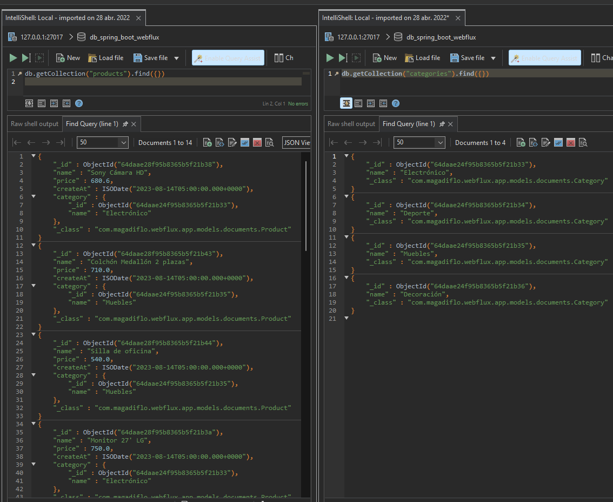

# Sección 3: Introducción programación reactiva con Spring WebFlux

Creación del proyecto


## Programación Reactiva

La programación reactiva es un paradigma de programación orientado al flujo de datos (streams) y la propagación del
cambio, todo de forma asíncrona.

Esto quiere decir que la programación reactiva se sustenta en el patrón de diseño Observer, donde se tiene un Publisher
y uno o más Suscribers que reciben notificaciones cuando el Publisher emite nuevos datos.

En la programación reactiva, **el Publisher es el que se encarga de emitir el flujo de datos** y **propaga el cambio
(notifica) a los Suscribers.**

Por lo tanto, podemos decir que la programación reactiva se basa en 3 conceptos clave:

- **Publisher:** También llamados **Observables.** Estos objetos son los que emiten el flujo de datos.
- **Suscriber:** También llamados **Observers.** Estos objetos son a los que se les notifican los cambios en el flujo de
  datos que emite el Publisher
- **Schedulers:** Es el componente que administra la concurrencia. Se encarga de indicarle a los Publishers y Suscribers
  en que thread deben ejecutarse.

## Agregando clases del modelo document y repository

Cuando trabajamos con SQL creábamos entities mapeados a tablas de una base de datos relacional. Ahora, como estamos
trabajando con MongoDB, que **es una base de datos NoSQL**, trabajaremos con **colecciones y no con tablas.**

Como primer paso, crearemos la colección a productos y su interface de repositorio:

````java

@Document(collection = "products")
public class Product {
    @Id
    private String id;
    private String name;
    private Double price;
    @DateTimeFormat(pattern = "yyyy-MM-dd")
    //<-- Para que la fecha se muestre correctamente en el input date o se obtenga de él en ese formado yyyy-MM-dd
    private LocalDate createAt;

    public Product() {
    }

    public Product(String name, Double price) {
        this.name = name;
        this.price = price;
    }

    /* getters and setters */
}
````

````java
public interface IProductRepository extends ReactiveMongoRepository<Product, String> {
}
````

## Importando datos de ejemplo y el operador flatMap

Si recordamos, cuando creábamos nuestra aplicación normal, basada en servlets, podíamos crear un archivo **import.sql**
para poder insertar en automático nuestros datos, pero como ahora estamos trabajando con una base de datos **NoSQL**,
debemos buscar otra manera de poder insertar datos de prueba. Una forma de hacerlo es de manera programática, veamos
cómo:

````java

@SpringBootApplication
public class SpringBootWebfluxApplication {

    private final static Logger LOG = LoggerFactory.getLogger(SpringBootWebfluxApplication.class);
    private final IProductRepository productRepository;

    public SpringBootWebfluxApplication(IProductRepository productRepository) {
        this.productRepository = productRepository;
    }

    /* main method omitted */

    @Bean
    public CommandLineRunner run() {
        return args -> {
            Flux.just(
                            new Product("Tv LG 70'", 3609.40),
                            new Product("Sony Cámara HD", 680.60),
                            new Product("Bicicleta Monteñera", 1800.60),
                            new Product("Monitor 27' LG", 750.00),
                            new Product("Teclado Micronics", 17.00),
                            new Product("Celular Huawey", 900.00),
                            new Product("Interruptor simple", 6.00),
                            new Product("Pintura Satinado", 78.00),
                            new Product("Pintura Base", 10.00),
                            new Product("Sillón 3 piezas", 10.00),
                            new Product("Separador para TV", 10.00),
                            new Product("Armario 2 puertas", 910.00),
                            new Product("Colchón Medallón 2 plazas", 710.00),
                            new Product("Silla de oficina", 540.00)
                    )
                    .flatMap(this.productRepository::save)
                    .subscribe(
                            product -> LOG.info("Insertado: {}, {}", product.getId(), product.getName()),
                            error -> LOG.error("Error al insertar: {}", error.getMessage()),
                            () -> LOG.info("¡Inserción completada!")
                    );

        };
    }
}
````

En el código anterior usamos la interfaz funcional **CommandLineRunner** anotándolo con **@Bean**. De esta manera
nuestra aplicación se ejecutará una vez arranque el mismo.

### flatMap

Estamos usando el flatMap, ya que dentro de él usamos el ``this.productRepository.save(product)`` para mandar a guardar
el **Product** emitido. Este **save()** nos retorna un ``Mono<Product>``. Finalmente, cuando hacemos el **subscribe()**
lo que recibimos es el model **product** guardado.

Ahora, corremos la aplicación y este será el resultado obtenido en consola:


Si revisamos la base de datos de MongoDB veremos que **por defecto se insertaron los productos en la base de datos
Test**, es decir, hasta este punto no hemos configurado ninguna base de datos, pero por defecto al ejecutar la
aplicación utilizó la base de datos **test** para insertar nuestros datos:


## Eliminando colección de productos (drop collection)

En la sección anterior implementamos el método **run()** de la interfaz funcional **CommandLineRunner** para poder
poblar la base de datos de MongoDB con valores iniciales. Ahora, el problema es que cada vez que levantamos la
aplicación los datos se van registrando, es decir se van duplicando los datos. Entonces para evitar eso,
lo que haremos será que antes de poblar la base de datos con registros, primero eliminaremos todo lo que haya en la
colección, de esa manera tendremos siempre el mismo conjunto de datos.

````java

@SpringBootApplication
public class SpringBootWebfluxApplication {

    /* Other code */
    private final ReactiveMongoTemplate reactiveMongoTemplate; // (1)

    public SpringBootWebfluxApplication(IProductRepository productRepository, ReactiveMongoTemplate reactiveMongoTemplate) {
        this.productRepository = productRepository;
        this.reactiveMongoTemplate = reactiveMongoTemplate;
    }

    @Bean
    public CommandLineRunner run() {
        return args -> {
            this.reactiveMongoTemplate.dropCollection("products").subscribe(); // (2)

            /* Código que puebla la colección de products */
        };
    }
}
````

**DONDE**

- **(1)** aplicamos inyección de dependencia vía constructor para el **ReactiveMongoTemplate**. Con esta clase podemos
  eliminar directamente la colección **products**.
- **(2)** usando el **ReactiveMongoTemplate** llamamos al método **dropCollection()** para eliminar la colección
  **products**.

### ReactiveMongoTemplate

ReactiveMongoTemplate es una clase auxiliar que nos ayuda a incrementar nuestras consultas a la BD mediante las
MongoOperations de manera reactiva.

Implementación principal de ReactiveMongoOperations. Simplifica el uso de Reactive MongoDB y ayuda a evitar errores
comunes. Ejecuta el flujo de trabajo central de MongoDB, dejando el código de la aplicación para proporcionar documentos
y extraer resultados. Esta clase ejecuta consultas o actualizaciones de BSON, iniciando la iteración sobre FindPublisher
y capturando las excepciones de MongoDB y traduciéndolas a la jerarquía de excepción genérica y más informativa definida
en el paquete org.springframework.dao.

## Cambiando el nombre de la base de datos y agregando la fecha createAt

Por defecto, cuando arrancamos la aplicación, los datos se van a poblar en la base de datos **test de mongoDB**, pero
ahora nosotros crearemos nuestra propia base de datos llamada **db_spring_boot_webflux**.

En el **application.properties** creamos la cadena de conexión a la base de datos de MongoDB agregándole el nombre que
le daremos a nuestra base de datos.
****

````properties
spring.data.mongodb.uri=mongodb://localhost:27017/db_spring_boot_webflux
````

Como nota final, si la base de datos **db_spring_boot_webflux** no está creada, al arrancar la aplicación, mongoDB
la va a crear por nosotros.

Ahora, con respecto a agregar fecha a nuestros registros, podemos usar el operador **flatMap()** para que en su interior
poblemos con la fecha actual a cada producto que va pasando:

````java

@SpringBootApplication
public class SpringBootWebfluxApplication {
    @Bean
    public CommandLineRunner run() {
        return args -> {
            this.reactiveMongoTemplate.dropCollection("products").subscribe();
            Flux.just(/* data */)
                    .flatMap(product -> {
                        product.setCreateAt(LocalDate.now()); //<-- asignando fecha actual a cada producto
                        return this.productRepository.save(product);
                    });
            /* other code */
        };
    }
}
````

**IMPORTANTE**

> **MongoDB almacena las horas en UTC de forma predeterminada y convierte cualquier representación de la hora local a
> este formato.** Las aplicaciones que deben operar o informar sobre algún valor de hora local sin modificar pueden
> almacenar la zona horaria junto con la marca de tiempo UTC y calcular la hora local original en su lógica de
> aplicación.
>
> [FUENTE: MongoDB](https://www.mongodb.com/docs/manual/tutorial/model-iot-data/)

Ahora, en nuestra aplicación de **Spring Boot**, nuestra base de datos **MongoDB** también está almacenando nuestra zona
de horario local en **UTC**, pero cuando lo recuperamos con las consultas de un **MongoRepository**, realiza la
conversión automáticamente y recupera nuestra fecha y hora correcta.


## Creando controlador y vista reactivos

Crearemos un controlador del tipo **@Controller**, ya que nuestras vistas serán renderizadas en plantillas html usando
**thymeleaf**.

````java

@Controller
@RequestMapping(path = {"/", "/products"})
public class ProductController {
    private final IProductRepository productRepository;

    public ProductController(IProductRepository productRepository) {
        this.productRepository = productRepository;
    }

    @GetMapping(path = {"/", "/list"})
    public String list(Model model) {
        Flux<Product> productFlux = this.productRepository.findAll();
        model.addAttribute("products", productFlux);
        model.addAttribute("title", "Listado de productos");
        return "list";
    }
}
````

Como observamos en el código anterior, **en ningún momento estamos haciendo el subscribe() del flux de productos para
empezar a recibir los datos.** Nosotros no debemos preocuparnos por eso, **quien se subscribirá al flux será la vista de
Thymeleaf**, él lo hará por nosotros.

El html usando Thymeleaf sería el siguiente (qu)

````html
<!DOCTYPE html>
<html lang="en" xmlns:th="http://www.thymeleaf.org">
<head>
    <meta charset="UTF-8">
    <title th:text="${title}"></title>
    <!-- link to bootstrap -->
</head>
<body>
<main class="container">
    <h1 th:text="${title}" class="my-3 border-bottom"></h1>
    <table class="table table-striped table-hover">
        <thead>
        <tr>
            <th>ID</th>
            <th>Nombre</th>
            <th>Precio</th>
            <th>Creación</th>
        </tr>
        </thead>
        <tbody>
        <tr th:each="product: ${products}">
            <td th:text="${product.id}"></td>
            <td th:text="${product.name}"></td>
            <td th:text="${product.price}"></td>
            <td th:text="${product.createAt}"></td>
        </tr>
        </tbody>
    </table>
</main>
</body>
</html>
````

Finalmente, al ejecutar la aplicación veremos el siguiente resultado:


## Subscribiendo otro Observador y modificando el Stream Reactivo

**(1)** Crearemos un nuevo **observer (suscriber)** que se subscribirá al **observable (publisher)** definido en la
variable **productFlux** para mostrar los datos en consola, este sería nuestro segundo subscriptor, el primero es
nuestra vista de Thymeleaf que también se encuentra subscrito por defecto a dicho observable.

Además, utilizamos el operador **map()** solo para hacer una modificación a cada elemento del flujo:

````java

@Controller
@RequestMapping(path = {"/", "/products"})
public class ProductController {
    private final static Logger LOG = LoggerFactory.getLogger(ProductController.class);
    /* omitted code */

    @GetMapping(path = {"/", "/list"})
    public String list(Model model) {
        Flux<Product> productFlux = this.productRepository.findAll()
                .map(product -> {
                    product.setName(product.getName().toUpperCase());
                    return product;
                });

        productFlux.subscribe(product -> LOG.info(product.getName())); // (1)

        model.addAttribute("products", productFlux);
        model.addAttribute("title", "Listado de productos");
        return "list";
    }
}
````

## Modo Reactive Data Driver para manejar la contrapresión

**Comportamiento por defecto:** Supongamos que tenemos muchos registros que serán mostrados en pantalla y experimentamos
un retraso de un segundo. Para configurar dicho retraso utilizaremos el operador **delayElements()** de flux para
decirle que se demorará en emitir cada elemento 1 segundo:

````java

@Controller
@RequestMapping(path = {"/", "/products"})
public class ProductController {

    @GetMapping(path = "/list-data-driver")
    public String listDataDriver(Model model) {
        Flux<Product> productFlux = this.productRepository.findAll()
                .map(product -> {
                    product.setName(product.getName().toUpperCase());
                    return product;
                })
                .delayElements(Duration.ofSeconds(1)); // <-- Configurando retraso de 1 segundo

        productFlux.subscribe(product -> LOG.info(product.getName()));

        model.addAttribute("products", productFlux);
        model.addAttribute("title", "Listado de productos");
        return "list";
    }
}
````

Ejecutamos la aplicación y observamos el comportamiento de este nuevo endpoint:


La imagen anterior nos muestra que se está cargando la página correspondiente al endpoint. **El tiempo que se demora
realizando esa carga es igual al número de elementos que el flux emite**, en nuestro caso tenemos 14 elementos y
cada elemento le toma 1 segundo en cargar (por el delay que pusimos), por lo tanto, **el tiempo que le toma en cargar
a nuestra página es de 14 segundos.**

El mismo comportamiento lo podemos observar en el log, donde los elementos se van cargando cada 1 segundo, en la
imagen solo se han cargado 4 elementos (4 segundos). Una vez que finaliza la emisión tendremos pintada todos los
elementos en la web:


Pero, qué pasa si tenemos 1000 elementos, **¿tendremos que esperar 1000 segundos?**. Si lo dejamos tal cual está en el
ejemplo anterior sí se demoraría los 1000 segundos, pero podemos evitar ese comportamiento **configurando el tamaño del
buffer que se irán emitiendo, esto gracias al Reactive Data Driver que es una variable de contexto de la lista,**
es un controlador que maneja internamente eventos con los datos del stream.

````java

@Controller
@RequestMapping(path = {"/", "/products"})
public class ProductController {

    @GetMapping(path = "/list-data-driver")
    public String listDataDriver(Model model) {
        Flux<Product> productFlux = this.productRepository.findAll()
                .map(product -> {
                    product.setName(product.getName().toUpperCase());
                    return product;
                })
                .delayElements(Duration.ofSeconds(1));

        productFlux.subscribe(product -> LOG.info(product.getName()));

        model.addAttribute("products", new ReactiveDataDriverContextVariable(productFlux, 2)); //<-- (1) Configuración del buffer
        model.addAttribute("title", "Listado de productos");
        return "list";
    }
}
````

Tan solo agregando esta clase **(1)** le podemos configurar **cada cuántos elementos se tienen que enviar a la web para
que se muestren** y no esperar a que se hayan emitido todos para recién mostrarlos en la web. En pocas palabras con esa
configuración iremos mostrando cada 2 elementos en la web.


La imagen anterior nos muestra que **la web se está cargando**, pero que mientras lo hace, va pintando cada 2 elementos
según se van emitiendo los elementos del flux.

## Modo Chunked para manejar la contrapresión

Con el modo chunked establecemos un límite, **un tamaño máximo para el chunked, es decir para el buffer, pero en bytes**
ya no con un número de elementos como lo hicimos en la sección anterior, donde le definimos al buffer 2 elementos.

Para usar el chunked, agregamos la siguiente configuración en el application.properties, donde se emitirán los elementos
de 1024 bytes en 1024 bytes. Ahora, si solo dejamos esta configuración, el **chunk** se aplicarán a todas las vistas,
a todos los templates de nuestro proyecto:

````properties
spring.thymeleaf.reactive.max-chunk-size=1024
````

El endpoint que ejecutaremos será al endpoint del list:

````java

@Controller
@RequestMapping(path = {"/", "/products"})
public class ProductController {

    @GetMapping(path = "/list-full")
    public String listFull(Model model) {
        ThymeleafReactiveViewResolver viewResolver = new ThymeleafReactiveViewResolver();
        viewResolver.setResponseMaxChunkSizeBytes(1024);


        Flux<Product> productFlux = this.productRepository.findAll()
                .map(product -> {
                    product.setName(product.getName().toUpperCase());
                    return product;
                })
                .repeat(5000); //<-- Repetimos 5000 veces el flujo actual

        model.addAttribute("products", productFlux);
        model.addAttribute("title", "Listado de productos");
        return "list";
    }
}
````

Listo, con esto lo que deberíamos observar sería que **cuando se intente ingresar por el navegador a la url**
``http://localhost:8080/products/list-full`` debería ir imprimiendo la lista de productos de manera fragmentada, es
decir, de 1024bytes en 1024bytes.

**NOTA**
> En mi caso, como estoy trabajando con Spring Boot 3 y Spring Framework 6, no estoy evidenciando el
> comportamiento que muestra Andrés Guzmán, no he investigado el porqué sucede esto, pero lo dejaré anotado, ya que
> mi intención es trabajar con Api Rest Reactivos, y este tema de Thymeleaf solo es para tener conocimiento de su
> funcionamiento

## Modo Chunked view names

Si queremos que la **contrapresión solo se aplique a determinadas vistas**, podemos utilizar una configuración adicional
en nuestro **application.properties**:

````properties
## other properties
spring.thymeleaf.reactive.chunked-mode-view-names=list-chunked
````

Donde el **list-chunked corresponde a la vista template que se va a renderizar**. Por lo tanto, crearemos un nuevo
controlador que nos renderizará la plantilla de thymeleaf **list-chunked**:

````java

@Controller
@RequestMapping(path = {"/", "/products"})
public class ProductController {
    /* other code */

    @GetMapping(path = "/list-chunked")
    public String listChunked(Model model) {
        Flux<Product> productFlux = this.productRepository.findAll()
                .map(product -> {
                    product.setName(product.getName().toUpperCase());
                    return product;
                })
                .repeat(5000);

        model.addAttribute("products", productFlux);
        model.addAttribute("title", "Listado de productos");
        return "list-chunked"; //<-- Plantilla thymeleaf que aplicará la contrapresión. Mismo nombre que está en el archivo de configuración
    }
}
````

Luego, en el directorio **/resources/templates/** crearemos una nueva plantilla html de thymeleaf, quien aplicará la
contrapresión. La plantilla será el mismo que hemos venido usando hasta ahora:

````html
<!-- more tags -->
<main class="container">
    <h1 th:text="${title}" class="my-3 border-bottom"></h1>
    <table class="table table-striped table-hover">
        <thead>
        <tr>
            <th>ID</th>
            <th>Nombre</th>
            <th>Precio</th>
            <th>Creación</th>
        </tr>
        </thead>
        <tbody>
        <tr th:each="product: ${products}">
            <td th:text="${product.id}"></td>
            <td th:text="${product.name}"></td>
            <td th:text="${product.price}"></td>
            <td th:text="${product.createAt}"></td>
        </tr>
        </tbody>
    </table>
</main>
<!-- more tags -->
````

## API REST en WebFlux

Crearemos un api rest utilizando programación reactiva.

````java

@RestController
@RequestMapping(path = "/api/v1/products")
public class ProductRestController {
    private final static Logger LOG = LoggerFactory.getLogger(ProductRestController.class);
    private final IProductRepository productRepository;

    public ProductRestController(IProductRepository productRepository) {
        this.productRepository = productRepository;
    }

    @GetMapping
    public Flux<Product> listProducts() { // (1)
        return this.productRepository.findAll()
                .doOnNext(product -> LOG.info(product.getName())); // (2)
    }

    @GetMapping(path = "/{id}")
    public Mono<Product> showProduct(@PathVariable String id) { // (3)
        return this.productRepository.findById(id)
                .doOnNext(product -> LOG.info(product.getName()));
    }

}
````

**(2)** doOnNext(), dispara efecto secundario, similar al tap() del RxJs. **Es importante tener en cuenta que doOnNext()
no modifica el flujo de datos original.** En este caso, estamos usando el **doOnNext()** solo para imprimir los
resultados en pantalla y ver los elementos que se van emitiendo por el flujo.

Listo, como observamos, tenemos dos endpoints, el primero **(1)** retorna un Flux de productos, mientras que el tercero
**(3)** retorna un Mono de un solo producto.

---

# CRUD con Thymeleaf Reactivo

---

## Creando el componente service para los productos

Crearemos el servicio que posteriormente será inyectado en el controlador:

````java
public interface IProductService {
    Flux<Product> findAll();

    Flux<Product> findAllWithNameUpperCase();

    Flux<Product> findAllWithNameUpperCaseAndRepeat();

    Mono<Product> findById(String id);

    Mono<Product> saveProduct(Product product);

    Mono<Void> delete(Product product);
} 
````

````java

@Service
public class ProductServiceImpl implements IProductService {
    private final IProductRepository productRepository;

    public ProductServiceImpl(IProductRepository productRepository) {
        this.productRepository = productRepository;
    }

    @Override
    public Flux<Product> findAll() {
        return this.productRepository.findAll();
    }

    @Override
    public Flux<Product> findAllWithNameUpperCase() {
        return this.productRepository.findAll()
                .map(product -> {
                    product.setName(product.getName().toUpperCase());
                    return product;
                });
    }

    @Override
    public Flux<Product> findAllWithNameUpperCaseAndRepeat() {
        return this.findAllWithNameUpperCase().repeat(5000);
    }

    @Override
    public Mono<Product> findById(String id) {
        return this.productRepository.findById(id);
    }

    @Override
    public Mono<Product> saveProduct(Product product) {
        return this.productRepository.save(product);
    }

    @Override
    public Mono<Void> delete(Product product) {
        return this.productRepository.delete(product);
    }
}
````

En el controlador reemplazamos el **IProductRepository** por nuestro **IProductService**.

## Agregando métodos handler en el controlador: crear y guardar

Crearemos el método handler para mostrar el formulario. **Hasta este momento nuestros métodos handler solo han retornado
un String correspondiente al nombre del template a renderizar**, pero ahora, **haremos que se retorne la vista de forma
reactiva**, es decir retornando un ``Mono<String>``:

````java

@Controller
@RequestMapping(path = {"/", "/products"})
public class ProductController {
    /* other code */
    @GetMapping(path = "/form")
    public Mono<String> create(Model model) {
        model.addAttribute("product", new Product());
        model.addAttribute("title", "Formulario de producto");
        return Mono.just("form");
    }

    @PostMapping(path = "/form")
    public Mono<String> save(Product product) {//de forma automática cuando se envía el formulario se envían los datos que están poblados en el objeto producto
        return this.productService.saveProduct(product)
                .doOnNext(p -> LOG.info("Producto guardado [id: {}, nombre: {}]", product.getId(), p.getName()))
                .thenReturn("redirect:/list");
    }
}
````

## Añadiendo la vista form

Crearemos dentro del directorio **/resources/templates/** el archivo html que contendrá nuestro formulario para agregar
productos. Nuestro formulario tendrá la siguiente configuración:

````html

<form action="#" th:action="@{/products/form}" th:object="${product}" method="post">
    <div class="mb-3">
        <label for="name" class="form-label">Nombre</label>
        <input type="text" class="form-control" id="name" th:field="*{name}">
    </div>
    <div class="mb-3">
        <label for="price" class="form-label">Precio</label>
        <input type="number" step="0.10" class="form-control" id="price" th:field="*{price}">
    </div>
    <div class="mb-3">
        <label for="createAt" class="form-label">Fecha</label>
        <input type="date" class="form-control" id="createAt" th:field="*{createAt}">
    </div>
    <button type="submit" class="btn btn-primary">Guardar</button>
</form>
````

Como observamos, el ``th:action="@{/products/form}"`` nos permite redirigir el formulario cuando se haga submit a la uri
``/products/form``. Notar que todo enlace en thymeleaf debe iniciar con un ``@``.

Otro punto importante a observar es ``th:object="${product}"``, de esta manera estamos enlazando el objeto **product**
que se envía desde la ruta ``GET /form`` con nuestro formulario. Ahora, para mapear cada atributo a su input
correspondiente, es que utilizamos ``th:field="*{name}"``, dentro de las llaves va el nombre de la propiedad al cual
enlazaremos el input, en este ejemplo estamos enlazando la propiedad **name**.

Cuando ejecutemos la aplicación, llenemos los datos en el formulario y le demos en **Guardar**, seremos redireccionados
a ``th:action="@{/products/form}"``, cuyos datos serán recibidos por el controlador **ProductController** y su método
handler ``POST /form``, quien realizará el guardado del producto en la BD.

**IMPORTANTE**

> Andrés Guzmán definió el atributo createAt del Producto como un Date de java.util. Por lo que, al vincular el atributo
> **th:field="*{createAt}"** con el input del tipo **date** ocurría un error en el formato de la fecha. Para
> solucionarlo se optó por agregar la anotación **@DateTimeFormat(pattern = "yyyy-MM-dd")** sobre el campo **Date** del
> modelo Producto.
>
> En mi caso, aprovechando las nuevas características de java, utilizo en el atributo createAt el tipo de dato
> **LocalDate**, de esta manera no tengo ningún problema al vincularlo al input html, ni hay la necesidad de agregar
> ninguna anotación, es decir, automáticamente la fecha seleccionada con el input date del html se mapea al atributo
> **createAt del tipo LocalDate.**

## Agregando método handler editar en el Controlador

Utilizaremos el mismo formulario de agregar productos para poder editarlos, pero es necesario que tengamos el
identificador del producto que vamos a editar, caso contrario, JPA al no detectar el id, o al ser el id null, en vez de
editar el producto lo terminará agregando. Por lo tanto, cuando mandemos el formulario para editar, debemos asegurarnos
de que también enviemos el id del producto. Podemos implementar 1 de 2 soluciones.

Antes de implementar las soluciones, observemos el método handler que creamos para poder abrir el formulario html
con el producto que será editado:

````java

@Controller
@RequestMapping(path = {"/", "/products"})
public class ProductController {
    /* other code */
    @GetMapping(path = "/form/{id}")
    public Mono<String> edit(@PathVariable String id, Model model) {
        Mono<Product> productMono = this.productService.findById(id)
                .doOnNext(product -> LOG.info(product.toString()))
                .defaultIfEmpty(new Product());
        model.addAttribute("product", productMono);
        model.addAttribute("title", "Editar producto");
        return Mono.just("form");
    }
}
````

La **primera es definiendo un input del tipo hidden** que contendrá el identificador del producto que se está editando:

````html

<form action="#" th:action="@{/products/form}" th:object="${product}" method="post">
    <input type="hidden" th:if="${product.id != null}" th:field="*{id}">
</form>
````

La **segunda forma es usar sesiones de Spring**, pero es una sesión especial, es **solo para manejar en el formulario.**

Si observamos en el código siguiente, veremos la anotación **@SessionAttributes(value = "product")**, esta anotación
indica los atributos de sesión que utiliza el controlador **ProductController**, en este caso el único atributo de
sesión del controlador que definimos es **product**. Este nombre **product** corresponde con el objeto que se pasa al
formulario.

Cada vez que se llama a los métodos handler **create() o edit()**, estos métodos nos mostrarán el formulario html para
poder crear o editar, respectivamente. Además, desde esos métodos, se pasa al formulario el objeto 'product' y cada
vez que eso ocurra, como tenemos anotado el controlador con **@SessionAttributes(value = "product")**, el objeto
'product' se guardará en la sesión http de forma momentánea estando disponible en el formulario. Además, solo se
actualizarán los campos que editemos en el formulario. El id estará presente, pero a nivel de sesión, ya que como no
tenemos un input que guarde el id, no lo podremos ver en la web, pero sí estará presente en la sesión.

Luego de enviar el formulario al método **save()**, ya sea para actualizar o guardar un producto, debemos eliminar la
sesión con **.setComplete()**.

````java

@SessionAttributes(value = "product") //<-- Atributo de sesión 'product' del formulario 
@Controller
@RequestMapping(path = {"/", "/products"})
public class ProductController {
    /* other code */
    @GetMapping(path = "/form")
    public Mono<String> create(Model model) {
        model.addAttribute("product", new Product()); //<-- No solo se pasa al formulario sino que se guarda en la sessión http por la anotación @SessionAttributes(value = "product")
        model.addAttribute("title", "Formulario de producto");
        return Mono.just("form");
    }

    @PostMapping(path = "/form")
    public Mono<String> save(Product product, SessionStatus sessionStatus) {//de forma automática cuando se envía el formulario se envían los datos que están poblados en el objeto producto
        sessionStatus.setComplete(); //<-- Marque el procesamiento de la sesión del controlador actual como completo, lo que permite la limpieza de los atributos de la sesión.
        return this.productService.saveProduct(product)
                .doOnNext(p -> LOG.info("Producto guardado: {}", p))
                .thenReturn("redirect:/list");
    }

    @GetMapping(path = "/form/{id}")
    public Mono<String> edit(@PathVariable String id, Model model) {
        Mono<Product> productMono = this.productService.findById(id)
                .doOnNext(product -> LOG.info(product.toString()))
                .defaultIfEmpty(new Product());
        model.addAttribute("product", productMono); //<-- No solo se pasa al formulario sino que se guarda en la sessión http por la anotación @SessionAttributes(value = "product")
        model.addAttribute("title", "Editar producto");
        return Mono.just("form");
    }
}
````

## Añadiendo otra forma del editar

Crearemos otro método editar, pero esta vez implementaremos el método en un solo flujo, pero eso nos provocaría cierto
error, pero ya lo veremos luego, por ahora veamos la implementación del nuevo método editar:

````java

@SessionAttributes(value = "product")
@Controller
@RequestMapping(path = {"/", "/products"})
public class ProductController {
    /* other code */
    @GetMapping(path = "/form-v2/{id}")
    public Mono<String> editV2(@PathVariable String id, Model model) {
        return this.productService.findById(id)
                .doOnNext(product -> {
                    LOG.info(product.toString());
                    model.addAttribute("product", product);
                    model.addAttribute("title", "Editar producto");
                    model.addAttribute("btnText", "Editar v2");
                })
                .defaultIfEmpty(new Product()) //<-- Si el findById no encuentra el producto entra en este método donde retornamos un nuevo producto
                .flatMap(product -> {
                    if (product.getId() == null) { //<-- Si hemos retornado un nuevo producto su id es null, por lo tanto, el producto no ha sido encontrado, entramos al if y lanzamos la excepción
                        return Mono.error(() -> new InterruptedException("No existe el producto"));
                    }
                    return Mono.just(product); // Si el producto viene con su id, significa que el findById sí lo encontró
                })
                .thenReturn("form") // Finalmente retornamos un Mono<String>, es decir nuestro formulario html
                .onErrorResume(throwable -> Mono.just("redirect:/list?error=no+existe+el+producto")); //<-- Si entró al if anterior y lanzamos el Mono.error(), este método lo captura. Hacemos un redirecto mandando un mensaje de error.
    }
}
````

A diferencia de nuestro primer método **edit()**, este segundo método **editV2()** realiza todo el proceso en un solo
flujo. **La desventaja** es que ahora ya no podremos usar el **@SessionAttributes(value = "product")**, es decir, la
session no se aplicará dentro del flujo, por consiguiente el atributo **product** no se guardará en la sesión, aunque
sí se enviará al formulario para editar gracias al **model.addAttribute("product", product)**, pero no estará disponible
en la sesión.

Recordemos que usábamos en el método **edit()** el **@SessionAttributes()** para guardar el producto y usar su id para
poder editar el producto en la base de datos. Entonces, como ahora en el método **editV2()** no se está guardando el
producto en la sesión, cuando demos en guardar, se registrará un nuevo producto más no lo editará.

Para solucionar ese problema, debemos agregar un ``<input type="hidden">`` que contendrá el valor del id para poder
editar.

````html

<form action="#" th:action="@{/products/form}" th:object="${product}" method="post">
    <input type="hidden" th:if="${product.id != null}" th:field="*{id}">
    <!-- other tags -->
</form>
````

## Actualización dependencia de Spring Boot Starter Validation

A partir de la versión de Spring Boot +2.3.0 debemos agregar la dependencia de **spring-boot-starter-validation** para
integrar y aprovechar las capacidades de validación de datos proporcionadas por la especificación de Bean Validation,
que es parte de Java EE (ahora Jakarta EE). **Esta dependencia facilita la validación de datos de entrada en tu
aplicación Spring Boot de manera declarativa y estandarizada.**

La validación de datos es esencial para garantizar que los datos ingresados por los usuarios o provenientes de fuentes
externas cumplan con ciertos requisitos antes de ser procesados o almacenados en la base de datos. Esto ayuda a prevenir
errores y asegura la integridad de los datos en tu aplicación.

Agrega las siguientes características al proyecto de Spring Boot:

1. Integración con la especificación de Bean Validation: @NotNull, @Size, @Min, @Max, etc.
2. Validación en el proceso de binding.
3. Manejo de errores de validación.
4. Configuración simplificada.

En nuestro caso, como estamos usando un proyecto de Spring Boot 3, es necesario agregar esta dependencia para hacer las
validaciones correspondientes:

````xml

<dependency>
    <groupId>org.springframework.boot</groupId>
    <artifactId>spring-boot-starter-validation</artifactId>
</dependency>
````

## Añadiendo validación en el formulario

Primero debemos anotar los campos que serán validados. En nuestro caso validaremos el campo name y price de la clase
de documento Product.

````java
import jakarta.validation.constraints.NotBlank;
import jakarta.validation.constraints.NotNull;

@Document(collection = "products")
public class Product {
    /* other code */
    @NotBlank
    private String name;
    @NotNull
    private Double price;
    /* other code*/
}
````

- **@NotBlank**, el elemento anotado no debe ser nulo y debe contener al menos un carácter que no sea un espacio en
  blanco. Acepta CharSequence.
- **@NotNull**, el elemento anotado no debe ser nulo. Acepta cualquier tipo.

La validación lo haremos al momento de que se llame al endpoint ``[POST] /form`` método **save()** usado para guardar el
formulario en la base de datos.

````java

@SessionAttributes(value = "product")
@Controller
@RequestMapping(path = {"/", "/products"})
public class ProductController {
    /* other code */
    @PostMapping(path = "/form")
    public Mono<String> save(@Valid Product product, BindingResult result, SessionStatus sessionStatus, Model model) {
        if (result.hasErrors()) {
            model.addAttribute("title", "Errores en el formulario de producto");
            model.addAttribute("btnText", "Guardar");
            return Mono.just("form");
        }
        sessionStatus.setComplete();
        if (product.getCreateAt() == null) {
            product.setCreateAt(LocalDate.now());
        }
        return this.productService.saveProduct(product)
                .doOnNext(p -> LOG.info("Producto guardado: {}", p))
                .thenReturn("redirect:/list?success=Producto+guardado+con+éxito");
    }
    /* other code */
}
````

En el código anterior vemos que se ha agregado la anotación ``@Valid`` antes de la clase de documento Product
(quien contiene las anotaciones de validación), además, para obtener los errores de la clase Product es que se ha
agregado como parámetro siguiente la clase **BindingResult** *(¡Importante! Tiene que ir siempre a continuación de la
clase que tenga la anotación @Valid)*, luego también se ha agregado la clase Model como parámetro para poder agregar
atributos a la vista.

````
@PostMapping(path = "/form")
public Mono<String> save(@Valid Product product, BindingResult result, SessionStatus sessionStatus, Model model) {...}
````

Dentro del método save(), se está haciendo una validación para poder ver si los elementos anotados de la clase Product
vienen con errores:

````
if (result.hasErrors()) {
    model.addAttribute("title", "Errores en el formulario de producto");
    model.addAttribute("btnText", "Guardar");
    return Mono.just("form");
}
````

Es importante resaltar aquí que **de forma automática** el objeto product pasado por parámetro``@Valid Product product``
se irá a la vista del form ``return Mono.just("form")`` cuando se haya detectado errores, e **incluso esos mismos
errores se irán a la vista para poder mostrarlos en el formulario.

También podríamos ser explícitos y usar la anotación **@ModelAttribute()** para definir un nombre con el cual pasar
automáticamente el Product a la vista:

````
@PostMapping(path = "/form")
public Mono<String> save(@Valid @ModelAttribute("product") Product product, BindingResult result, SessionStatus sessionStatus, Model model) {...}
````

Pero en nuestro caso no es necesario, ya que **de manera automática se está pasando el objeto Product a la vista**, esto
ocurre así, porque al momento de abrir el formulario, es decir cuando vamos al endpoint ``[GET] /form`` método
**create(Model model)** allí estamos definiendo el atributo **product** que se pasará a la vista.

````
@GetMapping(path = "/form")
public Mono<String> create(Model model) {
    model.addAttribute("product", new Product()); <--- Atributo product que se pasará a la vista
    /* other code */
    return Mono.just("form");
}
````

Por lo tanto, cuando desde el formulario se le dé en el botón **submit**, ya existirá el atributo **product**, todo
ese formulario se irá al endpoint ``[POST] /form`` método **save()** para registrar los datos en la base de datos, y
es en este último método, donde ya viene el objeto product, con sus validaciones y si hay errores se abre nuevamente
el formulario conteniendo el objeto producto, pero esta vez con sus errores de validación.

Finalmente, debemos modificar el formulario html para poder mostrar los errores:

````html

<div>
    <label>Nombre</label>
    <input type="text" th:field="*{name}">
    <div th:if="${#fields.hasErrors('name')}" th:errors="*{name}"></div>
</div>

<div>
    <label>Precio</label>
    <input type="number" step="0.10" th:field="*{price}">
    <div th:if="${#fields.hasErrors('price')}" th:errors="*{price}"></div>
</div>
````

## Agregando método eliminar en el Controlador

Creamos el método delete en el controlador:

````java

@SessionAttributes(value = "product")
@Controller
@RequestMapping(path = {"/", "/products"})
public class ProductController {
    /* other code */
    @GetMapping(path = "/delete/{id}")
    public Mono<String> delete(@PathVariable String id) {
        return this.productService.findById(id)
                .defaultIfEmpty(new Product())
                .flatMap(product -> {
                    if (product.getId() == null) {
                        return Mono.error(() -> new InterruptedException("No existe el producto a eliminar")); // (1)
                    }
                    LOG.info("Producto a eliminar: {}", product);
                    return Mono.just(product);
                })
                .flatMap(this.productService::delete)
                .then(Mono.just("redirect:/list?success=Producto+eliminado+con+éxito"))
                .onErrorResume(throwable -> Mono.just("redirect:/list?error=no+existe+el+producto")); // (2)
    }
}
````

**(1)** si en ese punto se lanza la excepción con un **Mono.error()** en el punto **(2)** se captura ese error lanzado y
se determina qué hacer, en nuestro caso si ocurre una excepción haremos un redireccionamiento.

Finalmente, desde el listado html agregamos un botón para poder llamar a este endpoint:

````html

<td>
    <a th:href="@{/delete/} + ${product.id}" onclick="return confirm('¿Seguro que desea eliminar?')"
       class="btn btn-sm btn-danger">eliminar</a>
</td>
````

## Añadiendo relaciones de colecciones y nuevo documento categoría

Crearemos el documento Categoría para que cada Producto pertenezca una categoría:

````java

@Document(collection = "categories")
public class Category {
    @Id
    private String id;
    private String name;

    /* constructors, getters, setters, toString method */
}
````

Ahora, en nuestro documento Product agregamos la nueva columna que tendrá:

````java

@Document(collection = "products")
public class Product {
    /* other attributes */

    private Category category;

    /* other constructors */

    public Product(String name, Double price, Category category) {
        this(name, price);
        this.category = category;
    }

    /*getters and setters of category */
}
````

Crearemos el repositorio correspondiente al documento Category:

````java
public interface ICategoryRepository extends ReactiveMongoRepository<Category, String> {
}
````

Agregamos métodos adicionales a la interfaz IProductService:

````java
public interface IProductService {
    /* other methods */

    Flux<Category> findAllCategories();

    Mono<Category> findCategory(String id);

    Mono<Category> saveCategory(Category category);
}
````

Finalmente implementamos los métodos agregados:

````java

@Service
public class ProductServiceImpl implements IProductService {
    /* other code */
    private final ICategoryRepository categoryRepository;
    /* other code */

    @Override
    public Flux<Category> findAllCategories() {
        return this.categoryRepository.findAll();
    }

    @Override
    public Mono<Category> findCategory(String id) {
        return this.categoryRepository.findById(id);
    }

    @Override
    public Mono<Category> saveCategory(Category category) {
        return this.categoryRepository.save(category);
    }
}
````

## Añadiendo categorías de ejemplo y el operador thenMany

Al igual que hicimos con los productos, cada vez que iniciemos la aplicación agregaremos categorías a la base de datos e
inmediatamente agregaremos los productos con sus categorías.

````java

@SpringBootApplication
public class SpringBootWebfluxApplication {
    /* other code */
    private final IProductService productService;
    private final ReactiveMongoTemplate reactiveMongoTemplate;

    /* other code */

    @Bean
    public CommandLineRunner run() {
        return args -> {
            this.reactiveMongoTemplate.dropCollection("products").subscribe();
            this.reactiveMongoTemplate.dropCollection("categories").subscribe();        // (1)

            Category electronico = new Category("Electrónico");
            Category deporte = new Category("Deporte");
            Category muebles = new Category("Muebles");
            Category decoracion = new Category("Decoración");

            Flux.just(electronico, deporte, muebles, decoracion)
                    .flatMap(this.productService::saveCategory)                         // (2)
                    .doOnNext(category -> LOG.info("Categoría creada: {}", category))
                    .thenMany(                                                          // (3)
                            Flux.just(
                                            new Product("Tv LG 70'", 3609.40, electronico),
                                            new Product("Sony Cámara HD", 680.60, electronico),
                                            new Product("Bicicleta Monteñera", 1800.60, deporte),
                                            new Product("Monitor 27' LG", 750.00, electronico),
                                            new Product("Teclado Micronics", 17.00, electronico),
                                            new Product("Celular Huawey", 900.00, electronico),
                                            new Product("Interruptor simple", 6.00, decoracion)
                                            /* other products */
                                    )
                                    .flatMap(product -> {
                                        product.setCreateAt(LocalDate.now());
                                        return this.productService.saveProduct(product);
                                    })

                    )
                    .subscribe(
                            product -> LOG.info("Insertado: {}, {}, {}, {}", product.getId(), product.getName(), product.getCreateAt(), product.getCategory()),
                            error -> LOG.error("Error al insertar: {}", error.getMessage()),
                            () -> LOG.info("¡Inserción completada!")
                    );
        };
    }
}
````

- **(1)** eliminamos toda la colección de categorías al iniciar la aplicación, al igual que hicimos con productos.
- **(2)** por cada categoría agregada al flux, lo vamos a guardar en la base de datos utilizando el **productService**.
- **(3)** el **thenMany()** espera que el flux anterior, el de categorías se complete para que se empiece a ejecutar el
  publisher definido en su interior, un publisher del tipo Flux.

> Usamos **thenMany() con un Flux**<br>
> Usamos **un then() con un Mono**

Finalmente, así se estarían guardando los registros en la base de datos de MongoDB:



## Añadiendo campo select categoría en el formulario

Para poder mostrar la lista de categorías dentro de un select en el formulario primero debemos crear un método en el
controlador **ProductController** que nos retorne la lista de categorías.

````java

@SessionAttributes(value = "product")
@Controller
@RequestMapping(path = {"/", "/products"})
public class ProductController {
    /* omitted code */
    @ModelAttribute(name = "categories")
    public Flux<Category> categories() {
        return this.productService.findAllCategories();
    }
    /* omitted code */
}
````

Como observamos en el código anterior se creó un método que retorna un Flux<Category>, pero además observemos la
anotación ``@ModelAttribute()``, cuando usamos esta anotación sobre un método, el objeto que retorna el método pasará a
la vista de forma global en el atributo que le definamos en su interior, es decir, todas las vistas tendrán
automáticamente el objeto retornado por el método **categories()** y podrán acceder a él a través del atributo
**categories**

Ahora en el formulario, creamos una etiqueta ``<select>`` y utilizamos la variable **categories**:

````html
<label for="category.id" class="form-label">Categoría</label>
<select th:field="*{category.id}" id="category.id">
    <option value="">-- Seleccionar --</option>
    <option th:each="category: ${categories}" th:value="${category.id}" th:text="${category.name}"></option>
</select>
<div th:if="${#fields.hasErrors('category.id')}" th:errors="*{category.id}"></div>
````

**NOTA**

> El ``th:field="*{propiedad}"``, coloca automáticamente los atributos **id y name** en el elemento html donde se esté
> usando. El valor será la misma propiedad definida dentro del field
>
> En nuestro caso, estamos utilizando ``th:field="*{category.id}"`` dentro del elemento ``<select>``, por lo tanto,
> en automático se crea el id="category.id" y el name="category.id". Lo mismo ocurre para los otros elementos.
>
> Ahora, en mi caso agregué explícitamente en el elemento select el valor ``id=category.id``, aunque como dijimos, eso
> se agregará automáticamente, pero lo agregué para que el IDE no marque warning al momento de estar codeando, ya que
> tenemos un ``<label>`` que está esperando un id del select para hacer referencia.

## Persistiendo y asignando la categoría en el handler del controlador

Antes de hacer la persistencia, vamos a agregar las anotaciones de validación para cuando se intente guardar el
formulario sin haber seleccionado una categoría nos muestre el mensaje de error:

````java

@Document(collection = "products")
public class Product {
    /* omitted code */
    @Valid
    private Category category;
    /* omitted code */
}
````

Como nos interesa que se seleccione una categoría, eso significa que la categoría seleccionada debe tener un id distinto
de vacío, por lo tanto, debemos validar el id de la categoría, pero en este caso, estamos dentro de la clase producto y
el formulario html de registro gira en torno al producto, en consecuencia, debemos anotar con ``@Valid`` la propiedad
**Category** para que se apliquen las validaciones que tiene internamente la clase **Category**.

````java

@Document(collection = "categories")
public class Category {
    @Id
    @NotBlank // Esta será la validación que se aplique
    private String id;
    /* omitted code */
}
````

**NOTA**
> Recordar que la anotación **@Valid** es la misma que utilizamos en el parámetro del método **save()** para validar
> precisamente los atributos del objeto Product.
>
> La anotación **@Valid** marca una propiedad, un parámetro de método o un tipo de retorno de método para la validación
> en cascada.
>
> Las restricciones definidas en el objeto y sus propiedades se validan cuando se valida la propiedad, el parámetro del
> método o el tipo de devolución del método. Este comportamiento se aplica recursivamente.

Ahora sí, toca persistir el producto junto a su categoría:

````java

@SessionAttributes(value = "product")
@Controller
@RequestMapping(path = {"/", "/products"})
public class ProductController {
    /* omitted code*/
    @PostMapping(path = "/form")
    public Mono<String> save(@Valid Product product, BindingResult result, SessionStatus sessionStatus, Model model) {
        if (result.hasErrors()) {
            model.addAttribute("title", "Errores en el formulario de producto");
            model.addAttribute("btnText", "Guardar");
            return Mono.just("form");
        }
        sessionStatus.setComplete();

        return this.productService.findCategory(product.getCategory().getId())
                .flatMap(categoryDB -> {
                    if (product.getCreateAt() == null) {
                        product.setCreateAt(LocalDate.now());
                    }
                    product.setCategory(categoryDB);
                    return this.productService.saveProduct(product);
                }).doOnNext(p -> LOG.info("Producto guardado: {}", p))
                .thenReturn("redirect:/list?success=Producto+guardado+con+éxito");
    }
    /* omitted code*/
}
````
